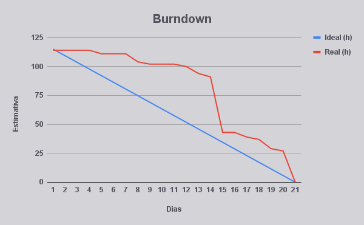
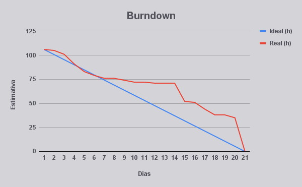

Automação e Extração de Informações em Atendimento Inteligente

## FATEC Prof Jessen Vidal, São José dos Campos - 5º Semestre DSM 2024

[Sobre :memo:](#sobre) | [Tecnologias :computer:](#tecnologias) | [Equipe :busts_in_silhouette:](#equipe) | [Entregas :rocket:](#entregas) | [Backlog :clipboard:](#backlog)

---

## :information_source: Sobre

Esse projeto foi desenvolvido pelos alunos do sexto semestre de 2025 do curso de Desenvolvimento de Software Multiplataforma da FATEC São José dos Campos - Professor Jessen Vidal.

Este projeto tem como objetivo desenvolver uma solução para analisar automaticamente grandes volumes de interações textuais geradas em sistemas automatizados de atendimento ao cliente, neste caso, CRM (Jira). A nossa solução visa extrair automaticamente os principais pontos discutidos nas conversas, classificar essas interações por sentimento e categoria, sumarizá-las e gerar insights diários que apoiem decisões estratégicas.

Dessa forma, o projeto busca melhorar a eficiência geral dos processos de atendimento, diminuir o esforço manual atualmente necessário na análise de dados, e facilitar a tomada de decisão com base em informações sintetizadas e relevantes obtidas das interações dos clientes.

---

## :computer: Tecnologias

  

  

---

## :busts_in_silhouette: Equipe

| :camera: Foto                         | :bust_in_silhouette: Nome           | :briefcase: Função | :octocat: Github                              | :link: LinkIdn                                                         |
| ------------------------------------- | ----------------------------------- | ------------------ | --------------------------------------------- | ---------------------------------------------------------------------- |
|    | Murilo Henrique Sangi da Silva Lima | Product Owner      | [Github](https://github.com/MuriloLima03)     | [LinkedIn](https://www.linkedin.com/in/murilo-sangi-944964313/)        |
|   | Matheus Fernando Vieira de Melo     | Scrum Master       | [Github](https://github.com/Matheusfvm)       | [LinkedIn](https://www.linkedin.com/in/matheusfvmelo/)                 |
|     | Pedro Henrique Silva Almeida        | Dev Team           | [Github](https://github.com/PedroHSdeAlmeida) | [LinkedIn](https://www.linkedin.com/in/pedroalmeidadev/)               |
|  | Vinicius de Oliveira Laranjeiro     | Dev Team           | [Github](https://github.com/vdlaranjeiro)     | [LinkedIn](https://www.linkedin.com/in/vinicius-laranjeiro-296b371bb/) |

---

## :rocket: Entregas

  
O projeto seguiu a metodologia ágil e foi dividido em 3 sprints, cada uma com um período de 20 dias

### Timeline das entregas

### Pipeline PLN

### Sprint 1

  
Detalhes da Sprint 1

   

**Objetivo da Sprint:**  
Nessa sprint, nosso foco foi na documentação do sistema, configuração da pipeline de PLN e construção dos dashboards para demonstrar os resultados da análise dos atendimentos.

**Sprint Backlog:**

| USID | Requisito    |
| ---- | ------------ |
| US01 | Dashboards   |
| US02 | Pipeline PLN |

**Burndown:**  

### Sprint 2

  
Detalhes da Sprint 2

   

**Objetivo da Sprint:**  
Nessa sprint, dividimos nosso foco em duas frentes Classificação dos atendimentos e Gerenciamento dos usuários.

**Sprint Backlog:**

| USID | Requisito    |
| ---- | ------------ |
| US02 | Extração de informações dos datasets |
| US03 | Pré-processamento dos dados |
| US04 | Classificação dos atendimentos |
| US05 | CRUD de usuários |

**Burndown:**  

### Sprint 3

  
Detalhes da Sprint 3

   

**Objetivo da Sprint:**  
Nessa sprint, nosso foco foi as correções e atualizações dos dashboards e na entrega dos modelos de sumarização e busca semântica.

**Sprint Backlog:**

| USID | Requisito    |
| ---- | ------------ |
| US06 | Sumarização  |
| US07 | Busca semântica |

**Burndown:**  

---

## :clipboard: Backlog

| USID | Sprint | Requisito                               |
| ---- | ------ | --------------------------------------- |
| US01 | 01     | Dashboards                              |
| US02 | 02     | Extração de informações dos datasets    |
| US03 | 02     | Pré-processamento dos dados             |
| US04 | 02     | Classificação dos atendimentos          |
| US05 | 02     | CRUD de usuários                        |
| US06 | 03     | Sumarização automática dos atendimentos |
| US07 | 03     | Busca Semântica                         |

## :scroll: User Stories

| USID | Descrição                                                                                                                                                                              |
| ---- | -------------------------------------------------------------------------------------------------------------------------------------------------------------------------------------- |
| US01 | Como usuário, quero que o sistema gere dashboards com informações das classificações e sumarização dos atendimentos para obter insights rápidos sobre o estado atual dos atendimentos. |
| US02 | Como usuário, quero que o sistema extraia informações relevantes do dataset de atendimento para serem analisadas pelos modelos de classificação e sumarização.                         |
| US03 | Como usuário, quero que o sistema aplique técnicas de pré-processamento nos dados extraídos para aumentar a eficácia dos modelos de classificação e sumarização.                       |
| US04 | Como usuário, quero que o sistema classifique o tipo e sentimento dos atendimentos para extrair informações precisas.                                                                  |
| US05 | Como administrador, quero cadastrar e gerenciar usuários para garantir o acesso ao sistema.                                                                                            |
| US06 | Como usuário, quero que o sistema gere um resumo automático das conversas para entender os principais pontos abordados.                                                                |
| US07 | Como usuário, quero buscar informações específicas nas interações passadas para obter dados rapidamente.                                                                               |                       |

