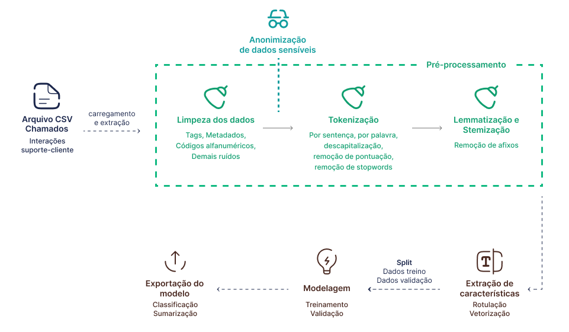

Automação e Extração de Informações em Atendimento Inteligente

## FATEC Prof Jessen Vidal, São José dos Campos - 5º Semestre DSM 2024

[Sobre :memo:](#sobre) | [Tecnologias :computer:](#tecnologias) | [Equipe :busts_in_silhouette:](#equipe) | [Entregas :rocket:](#entregas) | [Backlog :clipboard:](#backlog)

---

## :information_source: Sobre

Esse projeto foi desenvolvido pelos alunos do sexto semestre de 2025 do curso de Desenvolvimento de Software Multiplataforma da FATEC São José dos Campos - Professor Jessen Vidal.

Ele tem como objetivo desenvolver uma solução que permita a extração automática dos principais pontos de conversas, classificação das interações e geração de insights diários sobre os atendimentos, melhorando a eficiência e facilitando a tomada de decisão.

---

## :computer: Tecnologias

  

  

---

## :busts_in_silhouette: Equipe

| :camera: Foto                         | :bust_in_silhouette: Nome           | :briefcase: Função | :octocat: Github                              | :link: LinkIdn                                                         |
| ------------------------------------- | ----------------------------------- | ------------------ | --------------------------------------------- | ---------------------------------------------------------------------- |
|    | Murilo Henrique Sangi da Silva Lima | Product Owner      | [Github](https://github.com/MuriloLima03)     | [LinkedIn](https://www.linkedin.com/in/murilo-sangi-944964313/)        |
|   | Matheus Fernando Vieira de Melo     | Scrum Master       | [Github](https://github.com/Matheusfvm)       | [LinkedIn](https://www.linkedin.com/in/matheusfvmelo/)                 |
|     | Pedro Henrique Silva Almeida        | Dev Team           | [Github](https://github.com/PedroHSdeAlmeida) | [LinkedIn](https://www.linkedin.com/in/pedroalmeidadev/)               |
|  | Vinicius de Oliveira Laranjeiro     | Dev Team           | [Github](https://github.com/vdlaranjeiro)     | [LinkedIn](https://www.linkedin.com/in/vinicius-laranjeiro-296b371bb/) |

---

## :rocket: Entregas

  
O projeto seguiu a metodologia ágil e foi dividido em 3 sprints, cada uma com um período de 20 dias

### Timeline das entregas

### Pipeline PLN

### Sprint 1

  
Detalhes da Sprint 1

   

**Objetivo da Sprint:**  
Nessa sprint, nosso foco foi na documentação do sistema, configuração da pipeline de PLN e construção dos dashboards para demonstrar os resultados da análise dos atendimentos.

**Sprint Backlog:**

| USID | Requisito    |
| ---- | ------------ |
| US01 | Dashboards   |
| US02 | Pipeline PLN |

**Burndown:**  

---

## :clipboard: Backlog

| USID | Sprint | Requisito                               |
| ---- | ------ | --------------------------------------- |
| US01 | 01     | Dashboards                              |
| US02 | 02     | Extração de informações dos datasets    |
| US03 | 02     | Pré-processamento dos dados             |
| US04 | 02     | Anonimização de dados sensíveis         |
| US05 | 02     | Classificação dos atendimentos          |
| US06 | 02     | CRUD de usuários                        |
| US07 | 03     | Sumarização automática dos atendimentos |
| US08 | 03     | Busca Semântica                         |
| US09 | 03     | Conformidade com a LGPD                 |
| US10 | 03     | Deploy                                  |

## :scroll: User Stories

| USID | Descrição                                                                                                                                                                              |
| ---- | -------------------------------------------------------------------------------------------------------------------------------------------------------------------------------------- |
| US01 | Como usuário, quero que o sistema gere dashboards com informações das classificações e sumarização dos atendimentos para obter insights rápidos sobre o estado atual dos atendimentos. |
| US02 | Como usuário, quero que o sistema extraia informações relevantes do dataset de atendimento para serem analisadas pelos modelos de classificação e sumarização.                         |
| US03 | Como usuário, quero que o sistema aplique técnicas de pré-processamento nos dados extraídos para aumentar a eficácia dos modelos de classificação e sumarização.                       |
| US04 | Como usuário, quero que o sistema anonimize dados dos funcionários para proteger suas informações.                                                                                     |
| US05 | Como usuário, quero que o sistema classifique o tipo e sentimento dos atendimentos para extrair informações precisas.                                                                  |
| US06 | Como administrador, quero cadastrar e gerenciar usuários para garantir o acesso ao sistema.                                                                                            |
| US07 | Como usuário, quero que o sistema gere um resumo automático das conversas para entender os principais pontos abordados.                                                                |
| US08 | Como usuário, quero buscar informações específicas nas interações passadas para obter dados rapidamente.                                                                               |
| US09 | Como usuário, quero que o sistema se adeque à LGPD para garantir a segurança dos dados.                                                                                                |
| US10 | Como usuário, quero que o sistema esteja hospedado em uma solução de nuvem para evitar indisponibilidade.                                                                              |

